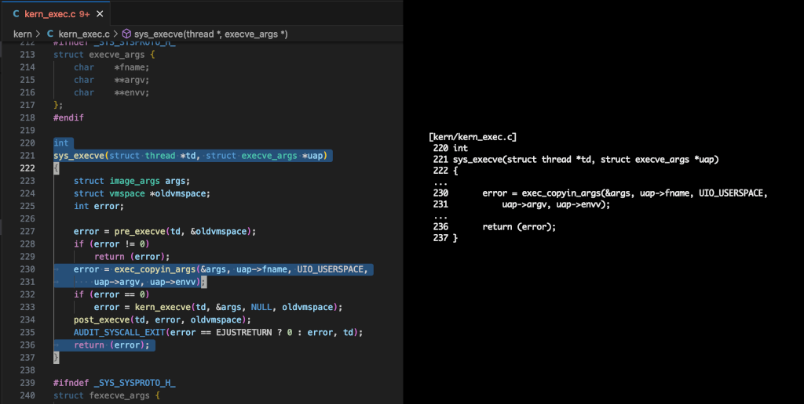

# Copy Snippet for VS Code


Copy Snippet is a Visual Studio Code extension for copying text with line
numbers and the file path to the clipboard.  Multi-region selections are
delimited with ellipses.

## Example

See the following screenshot of the before/after:



The verbatim text copied to the clipboard in this case was:

```text
     [kern/kern_exec.c]
      220 int
      221 sys_execve(struct thread *td, struct execve_args *uap)
      222 {
      ...
      230 	error = exec_copyin_args(&args, uap->fname, UIO_USERSPACE,
      231 	    uap->argv, uap->envv);
      ...
      236 	return (error);
      237 }
```

Notice that:

1. Spaces are used to indent the selection.
2. Ellipses delimit separate regions.

## Commands

Copy Snippet adds the following commands to the command pallete:

- Copy Snippet: Copy with path
- Copy Snippet: Copy

## Why?

My use case is for writing vulnerability reports on software where it's
helpful to include code snippets.  It helps with clarity in reports to
only include the relevant lines of code -- and so this is what the
extension is for.

The default indentation included by Copy Snippet is designed to be handy for
numbering lines:

```text
     [kern/kern_exec.c]
      220 int
      221 sys_execve(struct thread *td, struct execve_args *uap)
      222 {
      ...
[1]   230 	error = exec_copyin_args(&args, uap->fname, UIO_USERSPACE,
      231 	    uap->argv, uap->envv);
      ...
      236 	return (error);
      237 }
```

Which are then easily referred to [1] in the accompanying text.

## Configuration

|Property|Description|Type|Default value|
|---|---|---|---|
|`copy-snippet.indentation`|The indentation string to use.|String|`     `|
|`copy-snippet.continuationString`|The continuation string to use.|String|`...`|

## Thanks

- Thanks to [Copy With Line Numbers for VS Code](https://github.com/yassh/vscode-copy-with-line-numbers) which I used for inspiration in developing this.
- Thanks to DALL-E 3 for generating the icon/logo.
